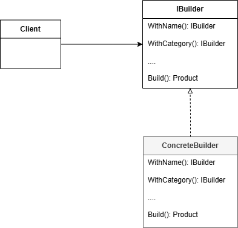
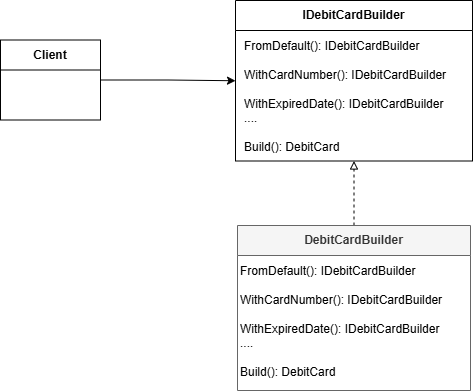

**Builder**

*Builder* is also a creational design pattern just like Factory and Abstract Factory. The main intent of the Builder Pattern is to simplify the construction of a complex object. Instead of using new keyword, the object is instructed step by step. 

The [IHostBuilder](https://learn.microsoft.com/en-us/dotnet/api/microsoft.extensions.hosting.ihostbuilder?view=dotnet-plat-ext-8.0&viewFallbackFrom=net-6.0), [WebApplicationBuilder](https://learn.microsoft.com/en-us/dotnet/api/microsoft.aspnetcore.builder.webapplicationbuilder?view=aspnetcore-6.0) are the familiar sample for using pattern.

Here is the diagram of implementation in the current repository.

