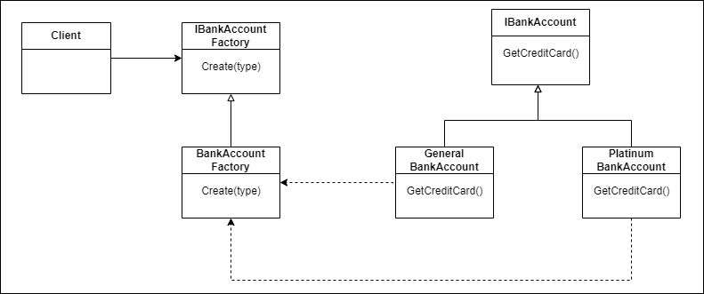

**Factory**

Factory is the creational design pattern that helps to create an object without exposing the creation login and the concrete type.

Client only need to provide the features required by factory.

