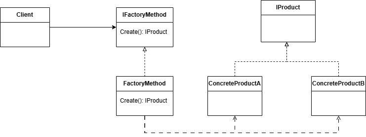

**Factory**

*Factory* is the creational design pattern that helps to create an object without exposing the creation logic and the concrete type.

Client only needs to provide the features required by factory.

Here is the diagram of implementation in the current repository

**Abstract Factory**

*Abstract Factory* is the creational pattern that produces families of related objects. 

Similar to the factory pattern, the creation logic and concrete type are not exposed to client when applying this pattern. However, there are several different:
-  Abstract factory includes many factories
-  One factory (parent) contains several sub-factories
-  One sub-factory provides one object type
-  One parent factory provides one variant object

