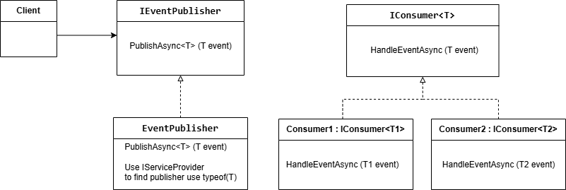
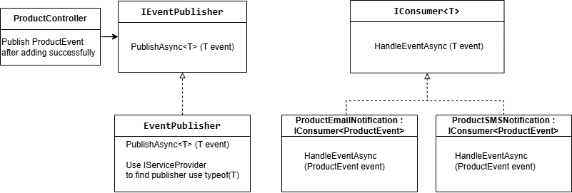

### Observer ###
**Observer** is a behavioral design pattern that lets you define a subscription mechanism to notify multiple consumers about any events that happen to the publishers they’re subscribing.

In this sample, instead of managing a list of subscribers directly within the publisher (like this [sample](https://refactoring.guru/design-patterns/observer)), I use dependency injection and generics to automatically locate and invoke the appropriate consumer based on the event type.

After successfully creating a new product, a ProductEvent is published. Two consumers then process the event and display notifications on the screen.

